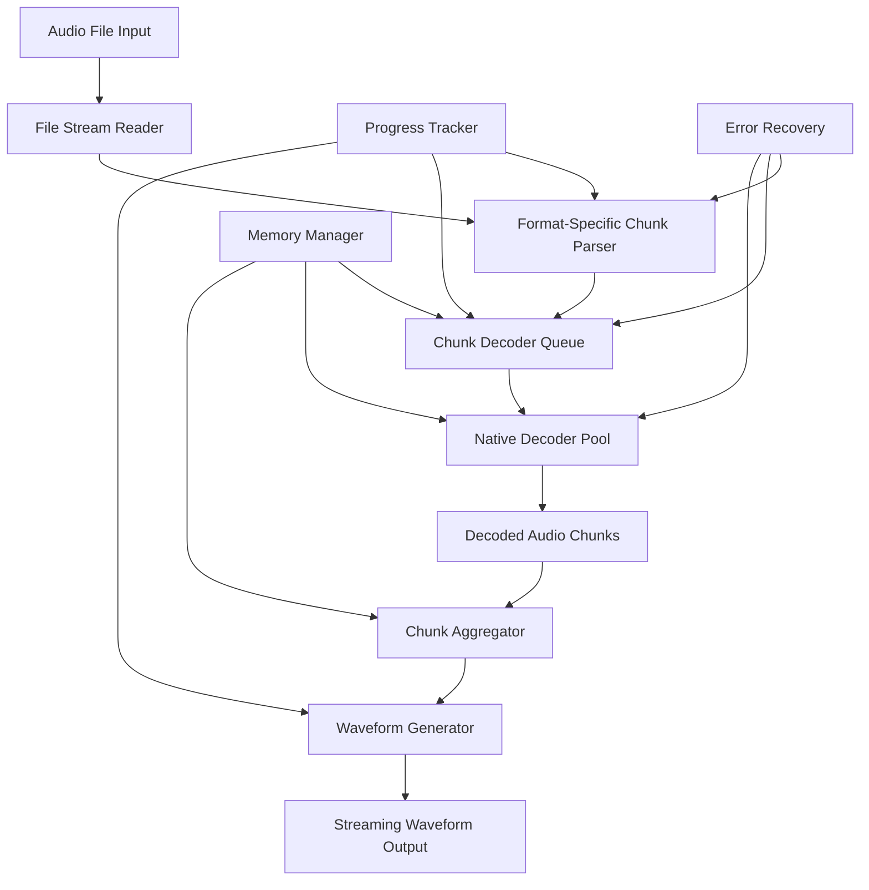

# Design Document

## Overview

The chunked audio decoding feature will fundamentally overhaul the existing Sonix library to process ALL audio files using a chunk-based approach instead of loading entire files into memory. This design ensures consistent memory usage, better performance, and scalability from small files to files larger than 10GB. The implementation will maintain backward compatibility while providing new streaming capabilities and memory management features.

## Architecture

### High-Level Architecture



### Core Components

1. **Chunked File Reader**: Reads audio files in configurable chunks
2. **Format-Aware Chunk Parser**: Handles format-specific boundaries and structures
3. **Streaming Decoder Interface**: Enhanced decoder interface for chunk processing
4. **Memory-Aware Chunk Manager**: Manages chunk lifecycle and memory usage
5. **Progressive Waveform Generator**: Generates waveforms from streaming chunks
6. **Seek-Capable Stream Handler**: Enables efficient seeking within large files

## Components and Interfaces

### 1. Chunked File Reader

**Purpose**: Provides efficient file reading in configurable chunks with seeking support

```dart
class ChunkedFileReader {
  final String filePath;
  final int chunkSize;
  final AudioFormat format;
  
  ChunkedFileReader({
    required this.filePath,
    required this.chunkSize,
    required this.format,
  });
  
  /// Read next chunk from current position
  Future<FileChunk?> readNextChunk();
  
  /// Seek to specific byte position in file
  Future<void> seekToPosition(int bytePosition);
  
  /// Seek to approximate time position
  Future<void> seekToTime(Duration position);
  
  /// Get total file size
  Future<int> getFileSize();
  
  /// Get current read position
  int get currentPosition;
  
  /// Check if end of file reached
  bool get isAtEnd;
  
  /// Close file and cleanup resources
  Future<void> close();
}

class FileChunk {
  final Uint8List data;
  final int startPosition;
  final int endPosition;
  final bool isLast;
  final bool isSeekPoint; // True if this chunk starts at a format-specific boundary
  
  const FileChunk({
    required this.data,
    required this.startPosition,
    required this.endPosition,
    required this.isLast,
    this.isSeekPoint = false,
  });
}
```

### 2. Enhanced Audio Decoder Interface

**Purpose**: Extended decoder interface supporting chunked processing

```dart
abstract class ChunkedAudioDecoder extends AudioDecoder {
  /// Initialize decoder for chunked processing
  Future<void> initializeChunkedDecoding(String filePath, {
    int chunkSize = 10 * 1024 * 1024, // 10MB default
    Duration? seekPosition,
  });
  
  /// Process a single file chunk and return decoded audio chunks
  Future<List<AudioChunk>> processFileChunk(FileChunk fileChunk);
  
  /// Seek to specific time position (format-specific implementation)
  Future<SeekResult> seekToTime(Duration position);
  
  /// Get format-specific chunk size recommendations
  ChunkSizeRecommendation getOptimalChunkSize(int fileSize);
  
  /// Check if format supports efficient seeking
  bool get supportsEfficientseeking;
  
  /// Get current decoding position
  Duration get currentPosition;
  
  /// Reset decoder state (useful after seeking)
  Future<void> resetDecoderState();
}

class SeekResult {
  final Duration actualPosition;
  final int bytePosition;
  final bool isExact;
  final String? warning;
  
  const SeekResult({
    required this.actualPosition,
    required this.bytePosition,
    required this.isExact,
    this.warning,
  });
}

class ChunkSizeRecommendation {
  final int recommendedSize;
  final int minSize;
  final int maxSize;
  final String reason;
  
  const ChunkSizeRecommendation({
    required this.recommendedSize,
    required this.minSize,
    required this.maxSize,
    required this.reason,
  });
}
```

### 3. Format-Specific Chunk Parsers

**Purpose**: Handle format-specific boundaries and structures for optimal chunking

```dart
abstract class FormatChunkParser {
  /// Parse chunk boundaries for optimal decoding
  List<ChunkBoundary> parseChunkBoundaries(FileChunk fileChunk);
  
  /// Find next valid seek point from given position
  Future<int> findNextSeekPoint(ChunkedFileReader reader, int fromPosition);
  
  /// Validate chunk integrity
  ChunkValidationResult validateChunk(FileChunk chunk);
  
  /// Get format-specific metadata from chunk
  FormatMetadata? extractMetadata(FileChunk chunk);
}

// MP3-specific implementation
class MP3ChunkParser extends FormatChunkParser {
  @override
  List<ChunkBoundary> parseChunkBoundaries(FileChunk fileChunk) {
    // Find MP3 frame boundaries within chunk
    final boundaries = <ChunkBoundary>[];
    
    // Scan for MP3 sync words (0xFFE0 or higher)
    for (int i = 0; i < fileChunk.data.length - 1; i++) {
      final syncWord = (fileChunk.data[i] << 8) | fileChunk.data[i + 1];
      if ((syncWord & 0xFFE0) == 0xFFE0) {
        boundaries.add(ChunkBoundary(
          position: fileChunk.startPosition + i,
          type: BoundaryType.frameStart,
          isSeekable: true,
        ));
      }
    }
    
    return boundaries;
  }
  
  @override
  Future<int> findNextSeekPoint(ChunkedFileReader reader, int fromPosition) async {
    // MP3 frames can start at any sync word
    // Read small chunks to find next frame boundary
    const searchChunkSize = 4096;
    await reader.seekToPosition(fromPosition);
    
    while (!reader.isAtEnd) {
      final chunk = await reader.readNextChunk();
      if (chunk == null) break;
      
      final boundaries = parseChunkBoundaries(chunk);
      if (boundaries.isNotEmpty) {
        return boundaries.first.position;
      }
    }
    
    return fromPosition; // Fallback to original position
  }
}

// FLAC-specific implementation  
class FLACChunkParser extends FormatChunkParser {
  @override
  List<ChunkBoundary> parseChunkBoundaries(FileChunk fileChunk) {
    // Find FLAC frame boundaries
    final boundaries = <ChunkBoundary>[];
    
    // FLAC frames start with sync code 0x3FFE
    for (int i = 0; i < fileChunk.data.length - 1; i++) {
      final syncWord = (fileChunk.data[i] << 8) | fileChunk.data[i + 1];
      if ((syncWord & 0xFFFE) == 0x3FFE) {
        boundaries.add(ChunkBoundary(
          position: fileChunk.startPosition + i,
          type: BoundaryType.frameStart,
          isSeekable: true,
        ));
      }
    }
    
    return boundaries;
  }
}

class ChunkBoundary {
  final int position;
  final BoundaryType type;
  final bool isSeekable;
  final Map<String, dynamic>? metadata;
  
  const ChunkBoundary({
    required this.position,
    required this.type,
    required this.isSeekable,
    this.metadata,
  });
}

enum BoundaryType {
  frameStart,
  frameEnd,
  blockStart,
  blockEnd,
  pageStart,
  pageEnd,
}

class ChunkValidationResult {
  final bool isValid;
  final List<String> warnings;
  final List<String> errors;
  
  const ChunkValidationResult({
    required this.isValid,
    this.warnings = const [],
    this.errors = const [],
  });
}
```

### 4. Memory-Aware Chunk Manager

**Purpose**: Manages chunk lifecycle, memory usage, and processing queue

```dart
class ChunkManager {
  final int maxMemoryUsage;
  final int maxConcurrentChunks;
  final MemoryPressureCallback? onMemoryPressure;
  
  ChunkManager({
    this.maxMemoryUsage = 100 * 1024 * 1024, // 100MB default
    this.maxConcurrentChunks = 3,
    this.onMemoryPressure,
  });
  
  /// Process chunks with memory management
  Stream<ProcessedChunk> processChunks(
    Stream<FileChunk> fileChunks,
    ChunkedAudioDecoder decoder,
  ) async* {
    final activeChunks = <ProcessingChunk>[];
    
    await for (final fileChunk in fileChunks) {
      // Wait for memory availability
      await _waitForMemoryAvailability();
      
      // Process chunk
      final processingChunk = ProcessingChunk(
        fileChunk: fileChunk,
        future: decoder.processFileChunk(fileChunk),
      );
      
      activeChunks.add(processingChunk);
      
      // Yield completed chunks and cleanup
      yield* _yieldCompletedChunks(activeChunks);
      
      // Limit concurrent processing
      if (activeChunks.length >= maxConcurrentChunks) {
        await activeChunks.first.future;
      }
    }
    
    // Process remaining chunks
    while (activeChunks.isNotEmpty) {
      yield* _yieldCompletedChunks(activeChunks);
      if (activeChunks.isNotEmpty) {
        await activeChunks.first.future;
      }
    }
  }
  
  /// Get current memory usage
  int getCurrentMemoryUsage();
  
  /// Force cleanup of completed chunks
  Future<void> forceCleanup();
  
  Stream<ProcessedChunk> _yieldCompletedChunks(List<ProcessingChunk> activeChunks) async* {
    final completedIndices = <int>[];
    
    for (int i = 0; i < activeChunks.length; i++) {
      if (activeChunks[i].future.isCompleted) {
        try {
          final audioChunks = await activeChunks[i].future;
          yield ProcessedChunk(
            fileChunk: activeChunks[i].fileChunk,
            audioChunks: audioChunks,
          );
          completedIndices.add(i);
        } catch (e) {
          // Handle chunk processing error
          yield ProcessedChunk(
            fileChunk: activeChunks[i].fileChunk,
            audioChunks: [],
            error: e,
          );
          completedIndices.add(i);
        }
      }
    }
    
    // Remove completed chunks (in reverse order to maintain indices)
    for (int i = completedIndices.length - 1; i >= 0; i--) {
      activeChunks.removeAt(completedIndices[i]);
    }
  }
  
  Future<void> _waitForMemoryAvailability() async {
    while (getCurrentMemoryUsage() > maxMemoryUsage) {
      onMemoryPressure?.call(getCurrentMemoryUsage(), maxMemoryUsage);
      await Future.delayed(const Duration(milliseconds: 10));
    }
  }
}

class ProcessingChunk {
  final FileChunk fileChunk;
  final Future<List<AudioChunk>> future;
  
  ProcessingChunk({required this.fileChunk, required this.future});
}

class ProcessedChunk {
  final FileChunk fileChunk;
  final List<AudioChunk> audioChunks;
  final Object? error;
  
  ProcessedChunk({
    required this.fileChunk,
    required this.audioChunks,
    this.error,
  });
  
  bool get hasError => error != null;
}

typedef MemoryPressureCallback = void Function(int currentUsage, int maxUsage);
```

### 5. Progressive Waveform Generator

**Purpose**: Generate waveforms from streaming audio chunks

```dart
class ProgressiveWaveformGenerator {
  final WaveformConfig config;
  final ProgressCallback? onProgress;
  
  ProgressiveWaveformGenerator({
    required this.config,
    this.onProgress,
  });
  
  /// Generate waveform from streaming chunks
  Stream<WaveformChunk> generateFromChunks(
    Stream<ProcessedChunk> processedChunks,
  ) async* {
    final aggregator = WaveformAggregator(config);
    int totalChunks = 0;
    int processedChunkCount = 0;
    
    await for (final processedChunk in processedChunks) {
      if (processedChunk.hasError) {
        // Handle chunk error - continue with next chunk
        onProgress?.call(ProgressInfo(
          processedChunks: processedChunkCount,
          totalChunks: totalChunks,
          hasErrors: true,
          lastError: processedChunk.error,
        ));
        continue;
      }
      
      // Process audio chunks from this file chunk
      for (final audioChunk in processedChunk.audioChunks) {
        final waveformChunk = aggregator.processAudioChunk(audioChunk);
        if (waveformChunk != null) {
          yield waveformChunk;
        }
      }
      
      processedChunkCount++;
      onProgress?.call(ProgressInfo(
        processedChunks: processedChunkCount,
        totalChunks: totalChunks,
      ));
    }
    
    // Yield final chunk if any remaining data
    final finalChunk = aggregator.finalize();
    if (finalChunk != null) {
      yield finalChunk;
    }
  }
  
  /// Generate complete waveform from streaming chunks
  Future<WaveformData> generateCompleteWaveform(
    Stream<ProcessedChunk> processedChunks,
  ) async {
    final chunks = <WaveformChunk>[];
    
    await for (final waveformChunk in generateFromChunks(processedChunks)) {
      chunks.add(waveformChunk);
    }
    
    return WaveformAggregator.combineChunks(chunks, config);
  }
}

class WaveformAggregator {
  final WaveformConfig config;
  final List<double> _accumulatedSamples = [];
  int _totalSamples = 0;
  
  WaveformAggregator(this.config);
  
  WaveformChunk? processAudioChunk(AudioChunk audioChunk) {
    _accumulatedSamples.addAll(audioChunk.samples);
    _totalSamples += audioChunk.samples.length;
    
    // Check if we have enough samples for a waveform chunk
    final samplesPerWaveformPoint = _calculateSamplesPerPoint();
    
    if (_accumulatedSamples.length >= samplesPerWaveformPoint) {
      return _generateWaveformChunk(samplesPerWaveformPoint);
    }
    
    return null;
  }
  
  WaveformChunk? finalize() {
    if (_accumulatedSamples.isNotEmpty) {
      return _generateWaveformChunk(_accumulatedSamples.length);
    }
    return null;
  }
  
  WaveformChunk _generateWaveformChunk(int samplesPerPoint) {
    final amplitudes = <double>[];
    
    for (int i = 0; i < _accumulatedSamples.length; i += samplesPerPoint) {
      final endIndex = (i + samplesPerPoint).clamp(0, _accumulatedSamples.length);
      final chunkSamples = _accumulatedSamples.sublist(i, endIndex);
      
      // Calculate amplitude for this point
      final amplitude = _calculateAmplitude(chunkSamples);
      amplitudes.add(amplitude);
    }
    
    // Clear processed samples
    _accumulatedSamples.clear();
    
    return WaveformChunk(
      amplitudes: amplitudes,
      startSample: _totalSamples - (_accumulatedSamples.length + amplitudes.length * samplesPerPoint),
      isLast: false,
    );
  }
  
  double _calculateAmplitude(List<double> samples) {
    switch (config.algorithm) {
      case DownsamplingAlgorithm.rms:
        final sumSquares = samples.fold<double>(0.0, (sum, sample) => sum + sample * sample);
        return (sumSquares / samples.length).sqrt();
      case DownsamplingAlgorithm.peak:
        return samples.fold<double>(0.0, (max, sample) => sample.abs() > max ? sample.abs() : max);
      case DownsamplingAlgorithm.average:
        return samples.fold<double>(0.0, (sum, sample) => sum + sample.abs()) / samples.length;
    }
  }
  
  int _calculateSamplesPerPoint() {
    // This would be calculated based on total expected samples and target resolution
    // For now, use a simple calculation
    return (_totalSamples / config.resolution).ceil();
  }
  
  static WaveformData combineChunks(List<WaveformChunk> chunks, WaveformConfig config) {
    final allAmplitudes = <double>[];
    
    for (final chunk in chunks) {
      allAmplitudes.addAll(chunk.amplitudes);
    }
    
    return WaveformData(
      amplitudes: allAmplitudes,
      duration: Duration.zero, // Would be calculated from audio metadata
      sampleRate: 0, // Would be set from audio metadata
      metadata: WaveformMetadata(
        resolution: allAmplitudes.length,
        type: config.type,
        normalized: config.normalize,
        generatedAt: DateTime.now(),
      ),
    );
  }
}

class ProgressInfo {
  final int processedChunks;
  final int totalChunks;
  final bool hasErrors;
  final Object? lastError;
  final Duration? estimatedTimeRemaining;
  
  const ProgressInfo({
    required this.processedChunks,
    required this.totalChunks,
    this.hasErrors = false,
    this.lastError,
    this.estimatedTimeRemaining,
  });
  
  double get progressPercentage => 
    totalChunks > 0 ? processedChunks / totalChunks : 0.0;
}

typedef ProgressCallback = void Function(ProgressInfo info);
```

## Data Models

### Enhanced Data Structures

```dart
// Enhanced WaveformChunk for streaming
class WaveformChunk {
  final List<double> amplitudes;
  final int startSample;
  final bool isLast;
  final Duration? timeOffset;
  final WaveformMetadata? metadata;
  
  const WaveformChunk({
    required this.amplitudes,
    required this.startSample,
    required this.isLast,
    this.timeOffset,
    this.metadata,
  });
}

// Configuration for chunked processing
class ChunkedProcessingConfig {
  final int fileChunkSize;
  final int maxMemoryUsage;
  final int maxConcurrentChunks;
  final bool enableSeeking;
  final bool enableProgressReporting;
  final Duration progressUpdateInterval;
  
  const ChunkedProcessingConfig({
    this.fileChunkSize = 10 * 1024 * 1024, // 10MB
    this.maxMemoryUsage = 100 * 1024 * 1024, // 100MB
    this.maxConcurrentChunks = 3,
    this.enableSeeking = true,
    this.enableProgressReporting = true,
    this.progressUpdateInterval = const Duration(milliseconds: 100),
  });
  
  /// Get optimal config for file size
  factory ChunkedProcessingConfig.forFileSize(int fileSize) {
    if (fileSize < 10 * 1024 * 1024) { // < 10MB
      return const ChunkedProcessingConfig(
        fileChunkSize: 1 * 1024 * 1024, // 1MB chunks
        maxConcurrentChunks: 2,
      );
    } else if (fileSize < 100 * 1024 * 1024) { // < 100MB
      return const ChunkedProcessingConfig(
        fileChunkSize: 5 * 1024 * 1024, // 5MB chunks
        maxConcurrentChunks: 3,
      );
    } else { // >= 100MB
      return const ChunkedProcessingConfig(
        fileChunkSize: 10 * 1024 * 1024, // 10MB chunks
        maxConcurrentChunks: 4,
      );
    }
  }
}
```

## Error Handling

### Chunked Processing Error Strategies

```dart
class ChunkedProcessingErrorHandler {
  final ErrorRecoveryStrategy strategy;
  final int maxRetries;
  final Duration retryDelay;
  
  ChunkedProcessingErrorHandler({
    this.strategy = ErrorRecoveryStrategy.skipAndContinue,
    this.maxRetries = 3,
    this.retryDelay = const Duration(milliseconds: 100),
  });
  
  Future<ProcessedChunk?> handleChunkError(
    FileChunk failedChunk,
    Object error,
    ChunkedAudioDecoder decoder,
  ) async {
    switch (strategy) {
      case ErrorRecoveryStrategy.skipAndContinue:
        return ProcessedChunk(
          fileChunk: failedChunk,
          audioChunks: [], // Empty chunks to maintain continuity
          error: error,
        );
        
      case ErrorRecoveryStrategy.retryWithSmallerChunk:
        return await _retryWithSmallerChunk(failedChunk, decoder);
        
      case ErrorRecoveryStrategy.seekToNextBoundary:
        return await _seekToNextBoundary(failedChunk, decoder);
        
      case ErrorRecoveryStrategy.failFast:
        rethrow;
    }
  }
  
  Future<ProcessedChunk?> _retryWithSmallerChunk(
    FileChunk failedChunk,
    ChunkedAudioDecoder decoder,
  ) async {
    // Try with progressively smaller chunks
    final originalSize = failedChunk.data.length;
    final sizes = [originalSize ~/ 2, originalSize ~/ 4, originalSize ~/ 8];
    
    for (final size in sizes) {
      if (size < 1024) break; // Don't go below 1KB
      
      try {
        final smallerChunk = FileChunk(
          data: failedChunk.data.sublist(0, size),
          startPosition: failedChunk.startPosition,
          endPosition: failedChunk.startPosition + size,
          isLast: false,
        );
        
        final audioChunks = await decoder.processFileChunk(smallerChunk);
        return ProcessedChunk(
          fileChunk: smallerChunk,
          audioChunks: audioChunks,
        );
      } catch (e) {
        // Continue with next smaller size
      }
    }
    
    return null; // All retry attempts failed
  }
}

enum ErrorRecoveryStrategy {
  skipAndContinue,
  retryWithSmallerChunk,
  seekToNextBoundary,
  failFast,
}
```

## Native Library Enhancements

### Chunked Decoding C Interface

```c
// Enhanced C interface for chunked processing
typedef struct {
    uint8_t* data;
    size_t size;
    size_t position;
    int is_last;
} SonixFileChunk;

typedef struct {
    float* samples;
    uint32_t sample_count;
    uint32_t start_sample;
    int is_last;
} SonixAudioChunk;

typedef struct {
    SonixAudioChunk* chunks;
    uint32_t chunk_count;
    int error_code;
    char* error_message;
} SonixChunkResult;

// Initialize chunked decoder
int sonix_init_chunked_decoder(int format, const char* file_path);

// Process file chunk and return audio chunks
SonixChunkResult* sonix_process_file_chunk(
    int decoder_id,
    SonixFileChunk* file_chunk
);

// Seek to time position
int sonix_seek_to_time(int decoder_id, uint32_t time_ms);

// Get optimal chunk size for format
uint32_t sonix_get_optimal_chunk_size(int format, uint64_t file_size);

// Cleanup chunked decoder
void sonix_cleanup_chunked_decoder(int decoder_id);

// Free chunk result
void sonix_free_chunk_result(SonixChunkResult* result);
```

## Performance Optimizations

### Memory Management Strategy

1. **Chunk Lifecycle Management**
   - Immediate disposal of processed chunks
   - Configurable memory pressure thresholds
   - Automatic quality reduction under memory pressure

2. **Concurrent Processing**
   - Limited concurrent chunk processing
   - Async/await for non-blocking operations
   - Isolate-based processing for CPU-intensive operations

3. **Caching Strategy**
   - LRU cache for frequently accessed file chunks
   - Metadata caching for seek operations
   - Intelligent prefetching based on access patterns

### Seeking Optimization

1. **Format-Specific Seek Tables**
   - Build seek tables during initial scan
   - Cache seek points for repeated access
   - Progressive seek table building

2. **Approximate Seeking**
   - Fast approximate seeking for large files
   - Progressive refinement to exact positions
   - Fallback to sequential processing when needed

## Testing Strategy

### Chunked Processing Tests

1. **Memory Usage Tests**
   - Verify memory stays within configured limits
   - Test with files from 1MB to 10GB+
   - Memory pressure simulation

2. **Accuracy Tests**
   - Compare chunked vs. full-file processing results
   - Verify no audio artifacts at chunk boundaries
   - Test with various chunk sizes

3. **Performance Tests**
   - Benchmark chunked vs. traditional processing
   - Measure memory usage over time
   - Test concurrent processing efficiency

4. **Error Recovery Tests**
   - Simulate corrupted chunks
   - Test various error recovery strategies
   - Verify graceful degradation

### Platform-Specific Testing

1. **Memory-Constrained Devices**
   - Test on devices with limited RAM
   - Verify automatic chunk size adjustment
   - Test memory pressure handling

2. **Large File Handling**
   - Test with files up to 10GB
   - Verify seeking performance
   - Test progress reporting accuracy

## Migration Strategy

### Backward Compatibility

1. **API Compatibility**
   - Existing APIs continue to work unchanged
   - Automatic chunked processing for large files
   - Optional explicit chunked processing APIs

2. **Performance Transition**
   - Gradual rollout of chunked processing
   - Fallback to original implementation if needed
   - Performance monitoring and comparison

3. **Configuration Migration**
   - New configuration options with sensible defaults
   - Migration guides for existing users
   - Deprecation warnings for old patterns

## Dependencies

### Additional Packages

```yaml
dependencies:
  # Existing dependencies remain
  stream_transform: ^2.1.0  # For advanced stream operations
  
dev_dependencies:
  # Existing dev dependencies remain
  test_process: ^2.1.0  # For testing with large files
```

### Native Library Updates

- Enhanced C libraries with chunked processing support
- Memory management improvements
- Seeking optimization for each format
- Error recovery mechanisms at native level