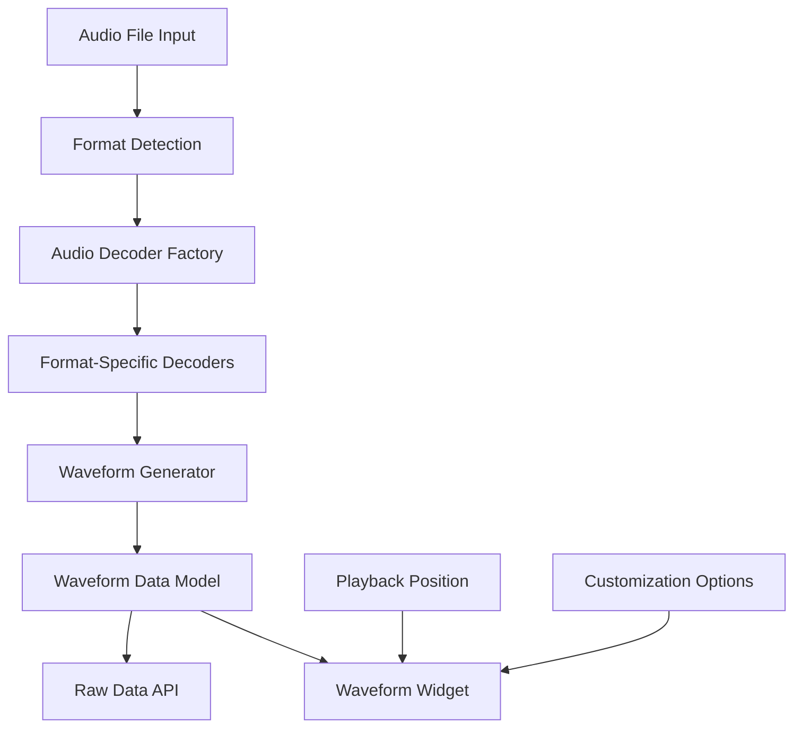

# Design Document

## Overview

The Flutter Audio Waveform package (Sonix) will provide a comprehensive solution for generating and displaying audio waveforms without relying on FFMPEG. The package will use specialized Dart/Flutter libraries for audio decoding and implement efficient algorithms for waveform generation and visualization.

## Architecture

### High-Level Architecture



### Core Components

1. **Audio Decoder Layer**: Handles multiple audio formats using specialized libraries
2. **Waveform Processing Layer**: Generates waveform data from decoded audio
3. **Data Model Layer**: Manages waveform data and metadata
4. **Visualization Layer**: Renders waveforms with customization options
5. **API Layer**: Provides public interfaces for developers

## Components and Interfaces

### 1. Audio Decoder Factory

**Purpose**: Manages format detection and decoder selection using native C libraries

```dart
abstract class AudioDecoderFactory {
  static AudioDecoder createDecoder(String filePath);
  static bool isFormatSupported(String extension);
  static List<String> getSupportedFormats();
}

// Native library bindings
class NativeAudioBindings {
  static final DynamicLibrary _lib = _loadLibrary();
  
  // MP3 decoder (minimp3)
  static final mp3DecodeFunction = _lib.lookupFunction<
    Int32 Function(Pointer<Uint8>, Int32, Pointer<Int16>, Pointer<Int32>),
    int Function(Pointer<Uint8>, int, Pointer<Int16>, Pointer<Int32>)
  >('mp3_decode');
  
  // FLAC decoder (dr_flac)
  static final flacDecodeFunction = _lib.lookupFunction<
    Pointer<Float> Function(Pointer<Uint8>, Pointer<Uint32>, Pointer<Uint32>, Pointer<Uint32>),
    Pointer<Float> Function(Pointer<Uint8>, Pointer<Uint32>, Pointer<Uint32>, Pointer<Uint32>)
  >('drflac_open_memory_and_read_pcm_frames_f32');
  
  // WAV decoder (dr_wav)
  static final wavDecodeFunction = _lib.lookupFunction<
    Pointer<Float> Function(Pointer<Uint8>, Pointer<Uint64>, Pointer<Uint32>, Pointer<Uint32>),
    Pointer<Float> Function(Pointer<Uint8>, Pointer<Uint64>, Pointer<Uint32>, Pointer<Uint32>)
  >('drwav_open_memory_and_read_pcm_frames_f32');
  
  // OGG Vorbis decoder (stb_vorbis)
  static final vorbisDecodeFunction = _lib.lookupFunction<
    Int32 Function(Pointer<Uint8>, Int32, Pointer<Int32>, Pointer<Int32>, Pointer<Pointer<Float>>),
    int Function(Pointer<Uint8>, int, Pointer<Int32>, Pointer<Int32>, Pointer<Pointer<Float>>)
  >('stb_vorbis_decode_memory');
}
```

**Implementation Strategy**:
- Use native C libraries through Dart FFI for optimal performance
- Implement factory pattern for decoder selection
- Support for multiple formats using MIT-compatible C libraries:
  - **minimp3** (CC0/Public Domain) for MP3 decoding
  - **dr_flac** (MIT/Public Domain) for FLAC decoding
  - **stb_vorbis** (MIT/Public Domain) for OGG Vorbis decoding
  - **dr_wav** (MIT/Public Domain) for WAV decoding
  - **libopus** (BSD 3-Clause) for Opus decoding
- Create Dart FFI bindings for each library
- Build native libraries for Android, iOS, Windows, macOS, Linux

### 2. Audio Decoder Interface

**Purpose**: Standardized interface for all audio decoders

```dart
abstract class AudioDecoder {
  Future<AudioData> decode(String filePath);
  Stream<AudioChunk> decodeStream(String filePath);
  Future<AudioMetadata> getMetadata(String filePath);
  void dispose();
}

class AudioData {
  final List<double> samples;
  final int sampleRate;
  final int channels;
  final Duration duration;
}

class AudioChunk {
  final List<double> samples;
  final int startSample;
  final bool isLast;
}
```

### 3. Waveform Generator

**Purpose**: Converts audio data to waveform visualization data

```dart
class WaveformGenerator {
  static Future<WaveformData> generate(
    AudioData audioData, {
    int resolution = 1000,
    WaveformType type = WaveformType.bars,
    bool normalize = true,
  });
  
  static Stream<WaveformChunk> generateStream(
    Stream<AudioChunk> audioStream, {
    int resolution = 1000,
    WaveformType type = WaveformType.bars,
  });
}

enum WaveformType { bars, line, filled }
```

**Processing Algorithm**:
- Downsample audio data to target resolution
- Calculate RMS or peak values for each segment
- Apply normalization if requested
- Support streaming processing for memory efficiency

### 4. Waveform Data Model

**Purpose**: Stores and manages waveform data

```dart
class WaveformData {
  final List<double> amplitudes;
  final Duration duration;
  final int sampleRate;
  final WaveformMetadata metadata;
  
  // Serialization support
  Map<String, dynamic> toJson();
  factory WaveformData.fromJson(Map<String, dynamic> json);
  
  // Memory management
  void dispose();
}

class WaveformMetadata {
  final int resolution;
  final WaveformType type;
  final bool normalized;
  final DateTime generatedAt;
}
```

### 5. Waveform Widget

**Purpose**: Renders waveform with customization and playback position

```dart
class WaveformWidget extends StatefulWidget {
  final WaveformData waveformData;
  final double? playbackPosition; // 0.0 to 1.0
  final WaveformStyle style;
  final VoidCallback? onTap;
  final Function(double)? onSeek;
  
  const WaveformWidget({
    required this.waveformData,
    this.playbackPosition,
    this.style = const WaveformStyle(),
    this.onTap,
    this.onSeek,
  });
}

class WaveformStyle {
  final Color playedColor;
  final Color unplayedColor;
  final Color backgroundColor;
  final double height;
  final double barWidth;
  final double barSpacing;
  final BorderRadius? borderRadius;
  final Gradient? gradient;
  final WaveformType type;
  
  const WaveformStyle({
    this.playedColor = Colors.blue,
    this.unplayedColor = Colors.grey,
    this.backgroundColor = Colors.transparent,
    this.height = 100.0,
    this.barWidth = 2.0,
    this.barSpacing = 1.0,
    this.borderRadius,
    this.gradient,
    this.type = WaveformType.bars,
  });
}
```

## Data Models

### Core Data Structures

1. **AudioData**: Raw decoded audio information
2. **WaveformData**: Processed waveform visualization data
3. **WaveformStyle**: Customization parameters
4. **AudioMetadata**: File information and properties

### Memory Management Strategy

- Implement lazy loading for large files
- Use streaming processing where possible
- Provide explicit disposal methods
- Cache frequently accessed data with LRU eviction
- Support different quality levels for memory vs. quality trade-offs

## Error Handling

### Error Types and Handling

1. **Unsupported Format Errors**
   - Return clear error messages
   - Provide list of supported formats
   - Graceful degradation

2. **File Access Errors**
   - Handle permission issues
   - Manage network file access
   - Provide retry mechanisms

3. **Memory Errors**
   - Implement memory pressure detection
   - Automatic quality reduction
   - Progressive loading strategies

4. **Decoding Errors**
   - Corrupted file handling
   - Partial decoding recovery
   - Format validation

### Error Classes

```dart
abstract class SonixException implements Exception {
  final String message;
  final String? details;
  const SonixException(this.message, [this.details]);
}

class UnsupportedFormatException extends SonixException {
  final String format;
  const UnsupportedFormatException(this.format) 
    : super('Unsupported audio format: $format');
}

class DecodingException extends SonixException {
  const DecodingException(String message, [String? details]) 
    : super(message, details);
}

class MemoryException extends SonixException {
  const MemoryException(String message) : super(message);
}
```

## Testing Strategy

### Unit Tests

1. **Audio Decoder Tests**
   - Format detection accuracy
   - Decoding correctness for each format
   - Error handling for corrupted files
   - Memory usage validation

2. **Waveform Generation Tests**
   - Algorithm correctness
   - Resolution scaling
   - Normalization accuracy
   - Streaming processing

3. **Data Model Tests**
   - Serialization/deserialization
   - Memory management
   - Data integrity

4. **Performance Tests**
   - Memory usage benchmarks
   - Processing speed measurements
   - Concurrent processing validation

### Test Data Strategy

- Create test audio files for each supported format
- Include corrupted files for error testing
- Various file sizes for performance testing
- Different audio characteristics (mono/stereo, various sample rates)

### Continuous Integration

- Automated testing on multiple Flutter versions
- Performance regression detection
- Memory leak detection
- Cross-platform compatibility testing

## Native Library Integration

### Build System Architecture

**Directory Structure:**
```
native/
├── src/
│   ├── minimp3/          # MP3 decoder source
│   ├── dr_flac/          # FLAC decoder source  
│   ├── dr_wav/           # WAV decoder source
│   ├── stb_vorbis/       # OGG Vorbis decoder source
│   ├── opus/             # Opus decoder source
│   └── sonix_native.c    # Unified C interface
├── CMakeLists.txt        # Main build configuration
├── android/
│   └── CMakeLists.txt    # Android-specific build
├── ios/
│   └── sonix_native.podspec
├── windows/
│   └── CMakeLists.txt
├── macos/
│   └── CMakeLists.txt
└── linux/
    └── CMakeLists.txt
```

**Unified C Interface (sonix_native.c):**
```c
// Unified decoder interface
typedef struct {
    float* samples;
    uint32_t sample_count;
    uint32_t sample_rate;
    uint32_t channels;
    uint32_t duration_ms;
} SonixAudioData;

// Format detection
int sonix_detect_format(const uint8_t* data, size_t size);

// Unified decode function
SonixAudioData* sonix_decode_audio(const uint8_t* data, size_t size, int format);

// Memory management
void sonix_free_audio_data(SonixAudioData* audio_data);
```

### FFI Bindings Generation

**ffigen Configuration (ffigen.yaml):**
```yaml
name: SonixNativeBindings
description: Native audio decoding bindings
output: 'lib/src/native/sonix_bindings.dart'
headers:
  entry-points:
    - 'native/src/sonix_native.h'
```

### Platform-Specific Considerations

1. **Android**: Use NDK for compilation, include in APK
2. **iOS**: Static library integration via CocoaPods
3. **Windows**: DLL compilation and distribution
4. **macOS**: Dynamic library with proper code signing
5. **Linux**: Shared library with dependency management

## Performance Optimizations

### Memory Efficiency

1. **Streaming Processing**: Process audio in chunks rather than loading entire files
2. **Lazy Loading**: Load waveform data only when needed
3. **Data Compression**: Use efficient data structures for amplitude storage
4. **Caching Strategy**: Implement intelligent caching with memory pressure awareness

### Speed Optimizations

1. **Parallel Processing**: Use isolates for CPU-intensive operations
2. **Native Extensions**: Consider native implementations for critical paths
3. **Algorithmic Optimization**: Use efficient downsampling algorithms
4. **Progressive Loading**: Display partial results while processing continues

### Widget Performance

1. **Custom Painting**: Use CustomPainter for efficient rendering
2. **Repaint Optimization**: Minimize unnecessary repaints
3. **Canvas Optimization**: Efficient drawing operations
4. **Animation Performance**: Smooth playback position updates

## Dependencies

### Required Packages

```yaml
dependencies:
  flutter:
    sdk: flutter
  ffi: ^2.1.0  # Native library bindings
  path: ^1.8.3  # File path utilities

dev_dependencies:
  flutter_test:
    sdk: flutter
  flutter_lints: ^5.0.0
  benchmark_harness: ^2.2.2  # Performance testing
  ffigen: ^13.0.0  # Generate FFI bindings
```

### Native Audio Decoding Libraries

**C Libraries (All MIT-compatible):**
- **minimp3** (CC0/Public Domain): Single-header MP3 decoder
- **dr_flac** (MIT/Public Domain): Single-header FLAC decoder  
- **dr_wav** (MIT/Public Domain): Single-header WAV decoder
- **stb_vorbis** (MIT/Public Domain): Single-header OGG Vorbis decoder
- **libopus** (BSD 3-Clause): Opus codec library

**Build System:**
- CMake build scripts for each platform
- Automated compilation during package build
- Static linking to avoid runtime dependencies

## API Design

### Public API Surface

```dart
// Main entry point
class Sonix {
  static Future<WaveformData> generateWaveform(String filePath, {
    int resolution = 1000,
    WaveformType type = WaveformType.bars,
  });
  
  static Stream<WaveformData> generateWaveformStream(String filePath, {
    int resolution = 1000,
    WaveformType type = WaveformType.bars,
  });
  
  static List<String> getSupportedFormats();
  static bool isFormatSupported(String filePath);
}

// Widget for display
class WaveformWidget extends StatefulWidget { /* ... */ }

// Data classes
class WaveformData { /* ... */ }
class WaveformStyle { /* ... */ }
```

### Usage Examples

```dart
// Generate waveform from file
final waveformData = await Sonix.generateWaveform('audio.mp3');

// Display with customization
WaveformWidget(
  waveformData: waveformData,
  playbackPosition: 0.3, // 30% played
  style: WaveformStyle(
    playedColor: Colors.blue,
    unplayedColor: Colors.grey.shade300,
    height: 80,
  ),
)

// Use pre-generated data
final jsonData = await loadWaveformFromCache();
final waveformData = WaveformData.fromJson(jsonData);
```