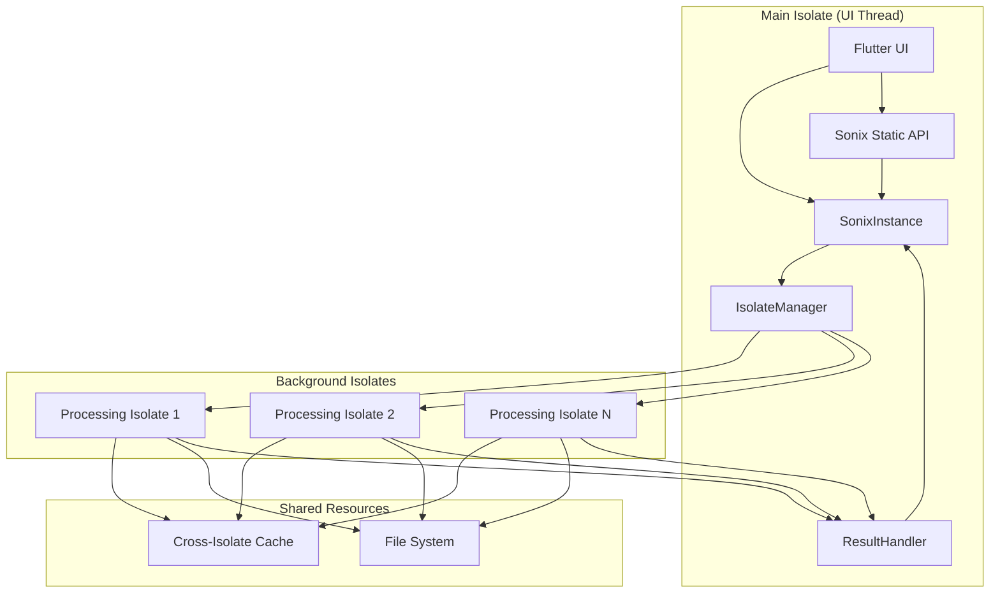

# Design Document

## Overview

This design transforms the Sonix library from a singleton-based static API to an instantiable, isolate-based architecture. The new design ensures all audio processing happens in background isolates, preventing UI thread blocking while maintaining a simple, user-friendly API focused on waveform generation for visualization purposes.

The architecture introduces a new `SonixInstance` class that manages its own isolate pool and provides both simple one-shot methods and streaming APIs. The existing static `Sonix` class will be maintained for backward compatibility but will internally delegate to a default `SonixInstance`.

## Architecture

### High-Level Architecture



### Core Components

1. **SonixInstance**: Main user-facing class that manages isolate-based processing
2. **IsolateManager**: Manages the lifecycle and communication with background isolates
3. **ProcessingIsolate**: Background isolate that performs audio decoding and waveform generation
4. **IsolateMessageHandler**: Handles serialization and communication between isolates
5. **CrossIsolateCache**: Cache system that works across isolate boundaries
6. **ResultHandler**: Manages results and progress updates from background isolates

## Components and Interfaces

### SonixInstance Class

```dart
class SonixInstance {
  // Configuration
  final SonixConfig config;
  
  // Core methods
  Future<WaveformData> generateWaveform(String filePath, {WaveformConfig? config});
  Stream<WaveformProgress> generateWaveformStream(String filePath, {WaveformConfig? config});
  
  // Resource management
  Future<void> dispose();
  
  // Utility methods
  bool isFormatSupported(String filePath);
  List<String> getSupportedFormats();
  ResourceStatistics getResourceStatistics();
}
```

### SonixConfig Class

```dart
class SonixConfig {
  final int maxConcurrentOperations;
  final int isolatePoolSize;
  final Duration isolateIdleTimeout;
  final int maxMemoryUsage;
  final bool enableCaching;
  final int maxCacheSize;
  final bool enableProgressReporting;
  
  const SonixConfig({
    this.maxConcurrentOperations = 3,
    this.isolatePoolSize = 2,
    this.isolateIdleTimeout = Duration(minutes: 5),
    this.maxMemoryUsage = 100 * 1024 * 1024, // 100MB
    this.enableCaching = true,
    this.maxCacheSize = 50,
    this.enableProgressReporting = true,
  });
}
```

### IsolateManager Class

```dart
class IsolateManager {
  // Isolate lifecycle management
  Future<void> initialize(SonixConfig config);
  Future<ProcessingResult> executeTask(ProcessingTask task);
  Future<void> dispose();
  
  // Resource management
  void optimizeResources();
  ResourceStatistics getStatistics();
}
```

### Message Protocol

```dart
// Base message types
abstract class IsolateMessage {
  final String id;
  final DateTime timestamp;
}

class ProcessingRequest extends IsolateMessage {
  final String filePath;
  final WaveformConfig config;
  final bool streamResults;
}

class ProcessingResponse extends IsolateMessage {
  final WaveformData? waveformData;
  final String? error;
  final bool isComplete;
}

class ProgressUpdate extends IsolateMessage {
  final double progress;
  final String? statusMessage;
}
```

### Cross-Isolate Cache

```dart
class CrossIsolateCache {
  // Cache operations that work across isolates
  Future<T?> get<T>(String key);
  Future<void> put<T>(String key, T value);
  Future<void> remove(String key);
  Future<void> clear();
  
  // Statistics
  CacheStatistics getStatistics();
}
```

## Data Models

### WaveformProgress

```dart
class WaveformProgress {
  final double progress; // 0.0 to 1.0
  final String? statusMessage;
  final WaveformData? partialData; // For streaming
  final bool isComplete;
  final String? error;
  
  const WaveformProgress({
    required this.progress,
    this.statusMessage,
    this.partialData,
    this.isComplete = false,
    this.error,
  });
}
```

### ProcessingTask

```dart
class ProcessingTask {
  final String id;
  final String filePath;
  final WaveformConfig config;
  final bool streamResults;
  final DateTime createdAt;
  
  const ProcessingTask({
    required this.id,
    required this.filePath,
    required this.config,
    this.streamResults = false,
    required this.createdAt,
  });
}
```

### Enhanced ResourceStatistics

```dart
class ResourceStatistics {
  final int activeIsolates;
  final int queuedTasks;
  final int completedTasks;
  final double memoryUsage;
  final CacheStatistics cacheStatistics;
  final Duration averageProcessingTime;
  final Map<String, dynamic> isolateStatistics;
  
  const ResourceStatistics({
    required this.activeIsolates,
    required this.queuedTasks,
    required this.completedTasks,
    required this.memoryUsage,
    required this.cacheStatistics,
    required this.averageProcessingTime,
    required this.isolateStatistics,
  });
}
```

## Error Handling

### Isolate Error Management

1. **Error Serialization**: All errors must be serializable across isolate boundaries
2. **Error Recovery**: Automatic retry mechanisms for transient failures
3. **Isolate Crash Detection**: Monitor isolate health and restart if necessary
4. **Graceful Degradation**: Fallback to synchronous processing if isolates fail

### Error Types

```dart
class IsolateProcessingException extends SonixException {
  final String isolateId;
  final String originalError;
  
  IsolateProcessingException(this.isolateId, this.originalError, String message) 
    : super(message);
}

class IsolateCommunicationException extends SonixException {
  final String messageType;
  
  IsolateCommunicationException(this.messageType, String message) 
    : super(message);
}
```

## Testing Strategy

### Unit Testing

1. **SonixInstance Tests**: Test all public methods and configuration options
2. **IsolateManager Tests**: Test isolate lifecycle and task distribution
3. **Message Protocol Tests**: Test serialization and deserialization
4. **Cache Tests**: Test cross-isolate cache functionality

### Integration Testing

1. **End-to-End Processing**: Test complete waveform generation pipeline
2. **Concurrent Processing**: Test multiple simultaneous operations
3. **Error Scenarios**: Test error handling and recovery
4. **Performance Tests**: Verify UI thread remains unblocked

### Isolate-Specific Testing

1. **Isolate Communication**: Test message passing reliability
2. **Resource Management**: Test isolate cleanup and resource disposal
3. **Error Propagation**: Test error handling across isolate boundaries
4. **Cache Synchronization**: Test cache consistency across isolates

## Implementation Phases

### Phase 1: Core Infrastructure
- Implement `SonixInstance` class with basic configuration
- Create `IsolateManager` for isolate lifecycle management
- Implement basic message protocol for isolate communication
- Add simple waveform generation in background isolates

### Phase 2: Advanced Features
- Implement streaming waveform generation with progress updates
- Add cross-isolate caching system
- Implement comprehensive error handling and recovery
- Add resource optimization and automatic cleanup

### Phase 3: Backward Compatibility
- Maintain existing static `Sonix` API as wrapper around `SonixInstance`
- Add deprecation warnings for static methods
- Provide migration utilities and documentation
- Ensure all existing functionality works through new architecture

### Phase 4: Optimization and Polish
- Performance optimization for isolate communication
- Memory usage optimization across isolates
- Advanced caching strategies
- Comprehensive testing and documentation

## Migration Strategy

### Backward Compatibility

The existing static `Sonix` class will be maintained and internally use a default `SonixInstance`:

```dart
class Sonix {
  static SonixInstance? _defaultInstance;
  
  static void initialize({SonixConfig? config}) {
    _defaultInstance = SonixInstance(config ?? SonixConfig());
  }
  
  @Deprecated('Use SonixInstance.generateWaveform instead')
  static Future<WaveformData> generateWaveform(String filePath, {WaveformConfig? config}) {
    return _defaultInstance!.generateWaveform(filePath, config: config);
  }
  
  // ... other static methods
}
```

### Migration Path

1. **Immediate**: Existing code continues to work without changes
2. **Gradual**: Developers can migrate to `SonixInstance` at their own pace
3. **Future**: Static methods will be removed in a future major version

## Performance Considerations

### Isolate Communication Optimization

1. **Message Batching**: Batch multiple small messages to reduce overhead
2. **Binary Serialization**: Use efficient serialization for large data
3. **Streaming Results**: Stream large results instead of sending all at once
4. **Connection Pooling**: Reuse isolate connections to reduce setup overhead

### Memory Management

1. **Lazy Isolate Creation**: Create isolates only when needed
2. **Automatic Cleanup**: Clean up idle isolates after timeout
3. **Memory Monitoring**: Monitor memory usage across all isolates
4. **Cache Optimization**: Intelligent cache eviction across isolates

### Caching Strategy

1. **Multi-Level Caching**: Cache at both main isolate and processing isolate levels
2. **Cache Synchronization**: Keep caches synchronized across isolates
3. **Intelligent Prefetching**: Prefetch likely-to-be-needed data
4. **Memory-Aware Eviction**: Evict based on memory pressure and usage patterns