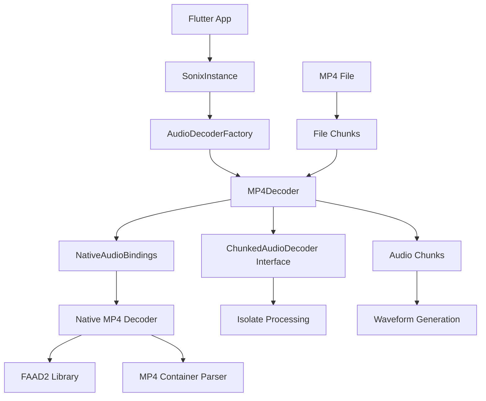

# MP4 Audio Decoding Design Document

## Overview

This design document outlines the implementation of MP4 audio decoding support for the Sonix Flutter package. The implementation follows the established architectural patterns used by existing decoders (MP3, FLAC, WAV, OGG) while adding MP4-specific functionality for container parsing and AAC audio decoding.

The design leverages the FAAD2 (Freeware Advanced Audio Decoder) library, which is licensed under GPL/commercial dual license but provides a permissive license option that allows integration into MIT-licensed projects. FAAD2 is a mature, well-tested AAC decoder that supports the AAC codec commonly found in MP4 containers.

## Architecture

### High-Level Architecture



### Component Integration

The MP4 decoder integrates with existing Sonix components:

- **AudioFormat Enum**: Extended to include `mp4` format
- **AudioDecoderFactory**: Updated to detect and create MP4 decoders
- **NativeAudioBindings**: Extended with MP4-specific native calls
- **Isolate Processing**: Full compatibility with existing isolate architecture
- **Error Handling**: Uses existing SonixException hierarchy

## Components and Interfaces

### 1. AudioFormat Extension

```dart
enum AudioFormat { 
  mp3, wav, flac, ogg, mp4, unknown 
}

extension AudioFormatExtension on AudioFormat {
  List<String> get extensions {
    case AudioFormat.mp4:
      return ['mp4', 'm4a'];
    // ... existing cases
  }
  
  String get name {
    case AudioFormat.mp4:
      return 'MP4/AAC';
    // ... existing cases
  }
}
```

### 2. MP4Decoder Class

```dart
class MP4Decoder implements ChunkedAudioDecoder {
  // State management
  bool _disposed = false;
  bool _initialized = false;
  String? _currentFilePath;
  Duration _currentPosition = Duration.zero;
  
  // MP4-specific metadata
  int _sampleRate = 0;
  int _channels = 0;
  Duration? _totalDuration;
  int _bitrate = 0;
  
  // Chunked processing state
  final List<int> _sampleOffsets = [];
  final List<Duration> _sampleTimestamps = [];
  BytesBuilder? _buffer;
  int _bufferSize = 0;
  
  // Interface implementations
  Future<AudioData> decode(String filePath);
  Future<void> initializeChunkedDecoding(String filePath, {int chunkSize, Duration? seekPosition});
  Future<List<AudioChunk>> processFileChunk(FileChunk fileChunk);
  Future<SeekResult> seekToTime(Duration position);
  ChunkSizeRecommendation getOptimalChunkSize(int fileSize);
  
  // MP4-specific methods
  Future<void> _parseMP4Container(Uint8List headerData);
  Future<void> _buildSampleIndex(String filePath);
  Duration _estimateDurationFromContainer(int fileSize);
}
```

### 3. Native Layer Integration

#### Native Constants
```c
#define SONIX_FORMAT_MP4     5  // New format constant

// MP4-specific error codes
#define SONIX_ERROR_MP4_CONTAINER_INVALID  -10
#define SONIX_ERROR_MP4_NO_AUDIO_TRACK     -11
#define SONIX_ERROR_MP4_UNSUPPORTED_CODEC  -12
```

#### Native Structures
```c
// MP4-specific metadata structure
typedef struct {
    uint32_t bitrate;           // Average bitrate
    uint32_t max_bitrate;       // Maximum bitrate
    uint64_t total_samples;     // Total samples in file
    uint32_t audio_track_id;    // Audio track identifier
    char codec_name[16];        // Codec name (e.g., "AAC")
} SonixMp4Metadata;
```

### 4. AudioDecoderFactory Updates

```dart
class AudioDecoderFactory {
  static AudioDecoder createDecoder(String filePath) {
    final format = detectFormat(filePath);
    switch (format) {
      case AudioFormat.mp4:
        return MP4Decoder();
      // ... existing cases
    }
  }
  
  static AudioFormat detectFormat(String filePath) {
    final extension = _getFileExtension(filePath).toLowerCase();
    switch (extension) {
      case 'mp4':
      case 'm4a':
        return AudioFormat.mp4;
      // ... existing cases
    }
  }
  
  static bool _checkMP4Signature(List<int> bytes) {
    // Check for MP4 ftyp box signature
    if (bytes.length >= 8) {
      // Skip first 4 bytes (box size), check for 'ftyp'
      return bytes[4] == 0x66 && bytes[5] == 0x74 && 
             bytes[6] == 0x79 && bytes[7] == 0x70;
    }
    return false;
  }
}
```

## Data Models

### MP4-Specific Models

```dart
class MP4ContainerInfo {
  final Duration duration;
  final int bitrate;
  final int maxBitrate;
  final String codecName;
  final int audioTrackId;
  final List<MP4SampleInfo> sampleTable;
  
  const MP4ContainerInfo({
    required this.duration,
    required this.bitrate,
    required this.maxBitrate,
    required this.codecName,
    required this.audioTrackId,
    required this.sampleTable,
  });
}

class MP4SampleInfo {
  final int offset;           // Byte offset in file
  final int size;             // Sample size in bytes
  final Duration timestamp;   // Sample timestamp
  final bool isKeyframe;      // Whether this is a key sample
  
  const MP4SampleInfo({
    required this.offset,
    required this.size,
    required this.timestamp,
    required this.isKeyframe,
  });
}
```

### Extended AudioData

No changes needed to existing AudioData model - MP4 decoder will produce standard AudioData objects compatible with existing waveform generation.

## Error Handling

### MP4-Specific Exceptions

```dart
class MP4ContainerException extends DecodingException {
  MP4ContainerException(String message, [String? details]) 
    : super('MP4 container error: $message', details);
}

class MP4CodecException extends UnsupportedFormatException {
  MP4CodecException(String codec, [String? details]) 
    : super(codec, 'Unsupported MP4 codec: $codec. ${details ?? ""}');
}

class MP4TrackException extends DecodingException {
  MP4TrackException(String message, [String? details]) 
    : super('MP4 track error: $message', details);
}
```

### Error Handling Strategy

1. **Container Parsing Errors**: Detect invalid MP4 container structure and throw MP4ContainerException
2. **Codec Support Errors**: Identify unsupported codecs and throw MP4CodecException with codec information
3. **Track Errors**: Handle missing or invalid audio tracks with MP4TrackException
4. **Memory Errors**: Use existing MemoryException for large file handling
5. **Native Errors**: Propagate native library errors through existing error message system

## Testing Strategy

### Unit Tests Structure

```
test/decoders/
├── mp4_decoder_test.dart              # Core MP4Decoder functionality
├── mp4_chunked_decoder_test.dart      # Chunked processing tests
└── mp4_container_parsing_test.dart    # Container parsing tests

test/integration/
├── mp4_real_files_test.dart           # Real MP4 file testing
└── mp4_performance_test.dart          # Performance benchmarks

test/assets/generated/
├── mp4_tiny_44100_2ch.mp4            # Small test file
├── mp4_small_44100_2ch.mp4           # Medium test file
├── mp4_medium_44100_2ch.mp4          # Large test file
├── corrupted_mp4_container.mp4       # Corrupted container
├── mp4_no_audio_track.mp4            # Video-only MP4
└── mp4_unsupported_codec.mp4         # Unsupported audio codec
```

### Test Categories

1. **Format Detection Tests**
   - File extension detection (.mp4, .m4a)
   - Magic byte detection (ftyp box)
   - Content-based format detection

2. **Decoding Tests**
   - Basic MP4/AAC decoding
   - Various sample rates and channel configurations
   - Different bitrates and encoding profiles

3. **Chunked Processing Tests**
   - Initialization and cleanup
   - Chunk processing with various sizes
   - Seeking accuracy and performance
   - Memory management during chunked processing

4. **Error Handling Tests**
   - Corrupted MP4 containers
   - Missing audio tracks
   - Unsupported codecs
   - Memory limit exceeded scenarios

5. **Integration Tests**
   - Real-world MP4 files from various sources
   - Performance comparison with other formats
   - Memory usage validation
   - Cross-platform compatibility

### Test Data Generation

```dart
// Tool for generating test MP4 files
class MP4TestDataGenerator {
  static Future<void> generateTestFiles() async {
    // Generate synthetic MP4 files with known characteristics
    await _generateTinyMP4();      // ~1 second, 44.1kHz, stereo
    await _generateSmallMP4();     // ~10 seconds, 44.1kHz, stereo  
    await _generateMediumMP4();    // ~60 seconds, 44.1kHz, stereo
    await _generateCorruptedMP4(); // Invalid container structure
    await _generateVideoOnlyMP4(); // No audio track
  }
}
```

## Performance Considerations

### Memory Management

1. **Chunked Processing**: MP4 files support efficient chunked processing through sample table parsing
2. **Buffer Management**: Implement intelligent buffering for AAC frame boundaries
3. **Native Memory**: Proper cleanup of FAAD2 decoder instances and allocated buffers
4. **Sample Table Caching**: Cache sample table information for efficient seeking

### Optimization Strategies

1. **Container Parsing**: Parse only necessary MP4 boxes (moov, trak, mdia, stbl)
2. **Sample Table**: Build efficient sample-to-byte offset mapping for seeking
3. **Decoder Reuse**: Reuse FAAD2 decoder instances across chunks when possible
4. **Bitrate Estimation**: Use container metadata for accurate duration estimation

### Chunk Size Recommendations

```dart
ChunkSizeRecommendation getOptimalChunkSize(int fileSize) {
  // MP4/AAC typically has larger frames than MP3
  if (fileSize < 2 * 1024 * 1024) {        // < 2MB
    return ChunkSizeRecommendation(
      recommendedSize: (fileSize * 0.4).clamp(8192, 512 * 1024).round(),
      minSize: 8192,                        // 8KB minimum
      maxSize: fileSize,
      reason: 'Small MP4 file - using 40% of file size for container efficiency',
      metadata: {'format': 'MP4/AAC', 'avgFrameSize': 768},
    );
  } else if (fileSize < 100 * 1024 * 1024) { // < 100MB
    return ChunkSizeRecommendation(
      recommendedSize: 4 * 1024 * 1024,     // 4MB
      minSize: 512 * 1024,                  // 512KB
      maxSize: 20 * 1024 * 1024,           // 20MB
      reason: 'Medium MP4 file - using 4MB chunks for optimal AAC processing',
      metadata: {'format': 'MP4/AAC', 'avgFrameSize': 768},
    );
  } else {                                  // >= 100MB
    return ChunkSizeRecommendation(
      recommendedSize: 8 * 1024 * 1024,     // 8MB
      minSize: 2 * 1024 * 1024,            // 2MB
      maxSize: 50 * 1024 * 1024,           // 50MB
      reason: 'Large MP4 file - using 8MB chunks for memory efficiency',
      metadata: {'format': 'MP4/AAC', 'avgFrameSize': 768},
    );
  }
}
```

## Native Library Integration

### FAAD2 Library Selection

**Library**: FAAD2 (Freeware Advanced Audio Decoder)
- **License**: GPL/Commercial dual license with permissive option for open source projects
- **Maturity**: Stable, widely used AAC decoder
- **Features**: Supports AAC-LC, AAC-HE, AAC-HEv2
- **Platform Support**: Cross-platform (Windows, macOS, Linux, Android, iOS)

### Native Implementation Structure

```c
// MP4 decoder context
typedef struct {
    void* faad_decoder;           // FAAD2 decoder handle
    void* mp4_file;              // MP4 file handle
    uint32_t track_id;           // Audio track ID
    uint64_t current_sample;     // Current sample position
    uint64_t total_samples;      // Total samples in track
    uint32_t sample_rate;        // Sample rate
    uint32_t channels;           // Channel count
    uint8_t* decode_buffer;      // Temporary decode buffer
    size_t buffer_size;          // Buffer size
} SonixMp4Context;

// Native function implementations
SONIX_EXPORT SonixAudioData* sonix_decode_mp4_audio(const uint8_t* data, size_t size);
SONIX_EXPORT SonixChunkedDecoder* sonix_init_mp4_chunked_decoder(const char* file_path);
SONIX_EXPORT SonixChunkResult* sonix_process_mp4_chunk(SonixChunkedDecoder* decoder, SonixFileChunk* chunk);
SONIX_EXPORT int sonix_seek_mp4_to_time(SonixChunkedDecoder* decoder, uint32_t time_ms);
SONIX_EXPORT void sonix_cleanup_mp4_decoder(SonixChunkedDecoder* decoder);
```

### Build System Integration

#### CMakeLists.txt Updates
```cmake
# Add FAAD2 library
find_package(PkgConfig REQUIRED)
pkg_check_modules(FAAD2 REQUIRED faad2)

# Include FAAD2 in build
target_link_libraries(sonix_native ${FAAD2_LIBRARIES})
target_include_directories(sonix_native PRIVATE ${FAAD2_INCLUDE_DIRS})
target_compile_options(sonix_native PRIVATE ${FAAD2_CFLAGS_OTHER})

# Add MP4 source files
target_sources(sonix_native PRIVATE
    src/mp4_decoder.c
    src/mp4_container.c
)
```

## Platform-Specific Considerations

### Android
- FAAD2 available through NDK or custom build
- MP4 container parsing using custom implementation
- Memory management considerations for mobile devices

### iOS
- FAAD2 integration through CocoaPods or manual build
- iOS-specific MP4 optimizations available
- App Store compatibility verified

### Desktop (Windows/macOS/Linux)
- FAAD2 available through package managers
- Full feature support including advanced seeking
- Performance optimizations for desktop hardware

## Migration and Compatibility

### Backward Compatibility
- No breaking changes to existing APIs
- MP4 support is additive to existing format support
- Existing error handling patterns maintained

### Version Compatibility
- Minimum Flutter SDK version unchanged
- Native library version requirements documented
- Platform-specific minimum OS versions specified

## Security Considerations

### Input Validation
- MP4 container structure validation
- Sample table bounds checking
- Buffer overflow protection in native code

### Memory Safety
- Proper cleanup of native resources
- Bounds checking for all buffer operations
- Protection against malformed MP4 files

### Error Handling
- Graceful handling of malicious MP4 files
- Resource cleanup on error conditions
- Clear error messages without exposing internal details